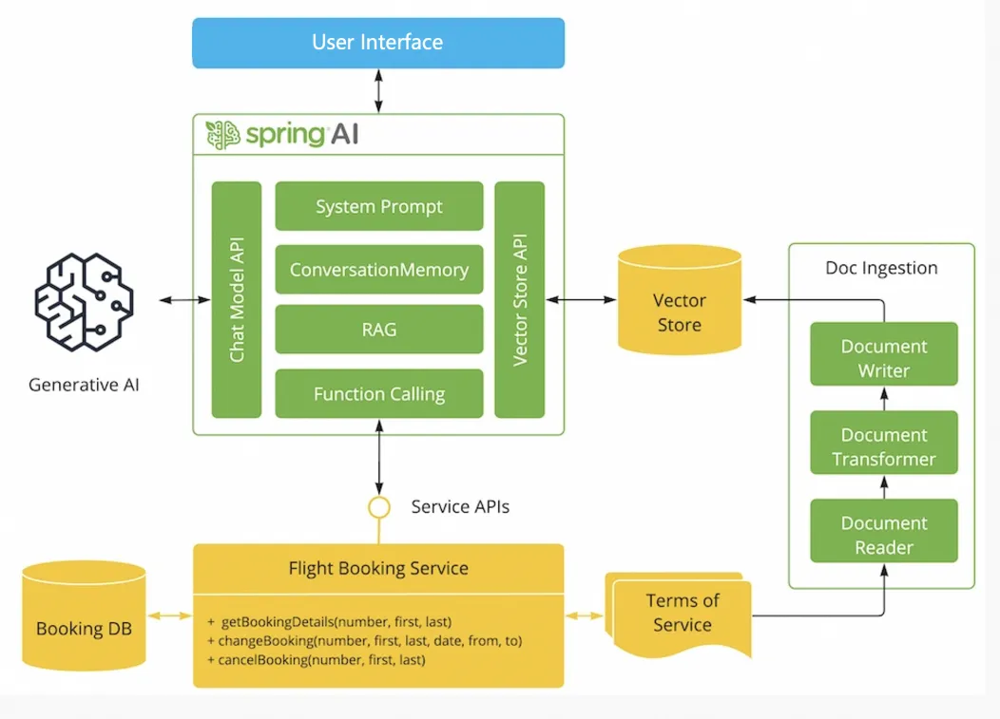

# AI Airline Customer Support RAG System | AI 航空客服 RAG 系统



---

### 1. 项目概览

本项目基于 Spring Boot + Spring AI Alibaba，构建了一个面向航空客服场景的 RAG 智能体后端系统。  
系统支持知识检索、会话记忆、工具调用，并提供可量化评测能力，便于持续优化。

本项目重点解决的问题是：如何将 RAG 从“能回答”升级为“可评测、可调优、可解释”的工程系统。

### 2. 核心特性

- 多源航空政策知识库入库（多文档来源）。
- 自定义中文文本切分策略，优化 chunk 边界质量。
- 元数据增强的检索块（`source` / `doc_type` / `chunk_id`），便于溯源与分析。
- 检索专用评测接口：`/api/assistant/retrieval`。
- 双层评测体系：仅检索评测 + 检索/生成全链路评测。
- 支持多轮会话记忆。
- 支持航空客服流程工具调用（机票查询、改签、退订）。

### 3. 系统架构

高层流程：

- 数据入库 -> 文本切分 -> 向量化 -> 向量库
- 用户问题 -> 向量检索 -> 提示词增强 -> 大模型生成 -> 最终答案

评测路径：

- 仅检索评测：`dataset -> /api/assistant/retrieval -> Hit@k / MRR / Recall@k`
- 全链路评测：`dataset -> /api/assistant/eval -> 检索 + 生成指标`

### 4. 评测框架

检索层指标：

- Hit@k（source-level）
- Hit@k（evidence-level）
- MRR（evidence-level）
- Recall@k（evidence-keywords）
- 平均检索延迟（`retrieval_ms`）

生成层指标：

- `keyword_score`
- `answer_pass`
- `refusal_compliance`（越界请求拒答合规）
- 端到端延迟（`latency_ms`）

### 5. 检索参数实验（topK）

实验脚本：`evaluation/run_retrieval_eval.py`  
评测数据集：`evaluation/airline_policy_eval_zh.json`  
每次样本数：24

| topK | samples_total | samples_failed | hit_at_k_source | hit_at_k_evidence | mrr_evidence | recall_at_k_evidence | avg_retrieval_ms |
|---|---:|---:|---:|---:|---:|---:|---:|
| 3 | 24 | 1 | 0.7500 | 0.7500 | 0.7500 | 0.7500 | 679.91 |
| 5 | 24 | 0 | 0.7917 | 0.7917 | 0.7917 | 0.7917 | 692.21 |
| 8 | 24 | 2 | 0.7083 | 0.7083 | 0.7083 | 0.7083 | 1727.55 |

结果分析：

- `topK=5` 在质量与稳定性之间达到最佳平衡，指标最高且失败样本为 0。
- `topK=3` 延迟略低，但覆盖与稳定性略弱。
- `topK=8` 引入更多低相关噪声，同时显著增加延迟。

结论：

- 当前推荐默认配置：**`topK=5`**。
- `topK=3` 适合更偏重低延迟的场景。
- `topK=8` 在当前配置下不推荐。

### 6. 关键接口

#### `GET /api/assistant/chat`
流式对话接口（SSE）。

Query params:

- `chatId`
- `userMessage`

#### `GET /api/assistant/eval`
全链路评测接口（检索 + 生成）。

Query params:

- `chatId`
- `userMessage`
- `topK`

#### `GET /api/assistant/retrieval`
仅检索评测接口（不触发大模型生成调用）。

Query params:

- `chatId`
- `userMessage`
- `topK`

### 7. 环境要求

- Java 17+
- 生成路径需配置环境变量：`AI_DASHSCOPE_API_KEY`

### 8. 启动方式

```bash
mvn spring-boot:run
```

`application.properties` 典型配置：

```properties
spring.ai.dashscope.api-key=${AI_DASHSCOPE_API_KEY}
spring.ai.dashscope.chat.options.model=qwen-max
```

### 9. 打包与前端构建

```bash
./mvnw clean package
java -jar ./target/playground-flight-booking-0.0.1-SNAPSHOT.jar
```

```bash
mvn clean compile -Pbuild-frontend
```

访问地址：`http://localhost:9000`

### 10. 工程亮点

- 不是仅靠 Prompt 的演示，而是完整的 RAG 后端工程链路。
- 具备可观测、可对比的检索评测指标体系（Hit@k / MRR / Recall@k）。
- 提供检索专用评测路径，可隔离外部模型波动影响。
- 在同一服务中整合了检索、会话记忆与工具调用能力。

### 11. 后续优化方向

- 引入重排（reranking）提升相关性排序。
- 探索混合检索（向量 + 关键词/BM25）。
- 按 `doc_type` 做检索过滤。
- 增强分阶段可观测性（延迟与失败分类）。
- 加强外部模型调用的失败处理与降级策略。

---

### 1. Project Overview

This project is a Spring Boot + Spring AI Alibaba backend for airline customer support with Retrieval-Augmented Generation (RAG).  
It integrates policy retrieval, chat memory, and tool calling, while providing measurable evaluation for iterative tuning.

The engineering goal is to make RAG not only answerable, but also observable, tunable, and explainable.

### 2. Key Features

- Multi-source airline policy knowledge ingestion.
- Custom Chinese text splitter for better chunk boundaries.
- Metadata-enriched chunks (`source`, `doc_type`, `chunk_id`) for traceability.
- Retrieval-only evaluation endpoint: `/api/assistant/retrieval`.
- Dual-layer evaluation: retrieval-only and end-to-end (retrieval + generation).
- Multi-turn conversation support with chat memory.
- Tool-calling workflow for support operations (booking details, change, cancel).

### 3. System Architecture

High-level pipeline:

- Ingestion -> Chunking -> Embedding -> Vector Store
- User Query -> Vector Retrieval -> Prompt Augmentation -> LLM Generation -> Final Answer

Evaluation paths:

- Retrieval-only: `dataset -> /api/assistant/retrieval -> Hit@k / MRR / Recall@k`
- End-to-end: `dataset -> /api/assistant/eval -> retrieval + generation metrics`

### 4. Evaluation Framework

Retrieval-level metrics:

- Hit@k (source-level)
- Hit@k (evidence-level)
- MRR (evidence-level)
- Recall@k (evidence-keywords)
- Average retrieval latency (`retrieval_ms`)

Generation-level metrics:

- `keyword_score`
- `answer_pass`
- `refusal_compliance` (out-of-scope refusal behavior)
- End-to-end latency (`latency_ms`)

### 5. Retrieval Parameter Experiment (topK)

Script: `evaluation/run_retrieval_eval.py`  
Dataset: `evaluation/airline_policy_eval_zh.json`  
Samples per run: 24

| topK | samples_total | samples_failed | hit_at_k_source | hit_at_k_evidence | mrr_evidence | recall_at_k_evidence | avg_retrieval_ms |
|---|---:|---:|---:|---:|---:|---:|---:|
| 3 | 24 | 1 | 0.7500 | 0.7500 | 0.7500 | 0.7500 | 679.91 |
| 5 | 24 | 0 | 0.7917 | 0.7917 | 0.7917 | 0.7917 | 692.21 |
| 8 | 24 | 2 | 0.7083 | 0.7083 | 0.7083 | 0.7083 | 1727.55 |

Analysis:

- `topK=5` provides the best balance of quality and stability.
- `topK=3` is slightly faster but has weaker coverage/stability.
- `topK=8` introduces extra low-relevance noise and much higher latency.

Conclusion:

- Recommended default: **`topK=5`**.
- `topK=3` is acceptable when latency is prioritized.
- `topK=8` is not recommended for the current setup.

### 6. API Endpoints

#### `GET /api/assistant/chat`
SSE chat endpoint for interactive conversation.

Query params:

- `chatId`
- `userMessage`

#### `GET /api/assistant/eval`
End-to-end evaluation endpoint (retrieval + generation).

Query params:

- `chatId`
- `userMessage`
- `topK`

#### `GET /api/assistant/retrieval`
Retrieval-only evaluation endpoint (no generation call).

Query params:

- `chatId`
- `userMessage`
- `topK`

### 7. Requirements

- Java 17+
- `AI_DASHSCOPE_API_KEY` (required for generation paths)

### 8. Run

```bash
mvn spring-boot:run
```

Typical `application.properties` entries:

```properties
spring.ai.dashscope.api-key=${AI_DASHSCOPE_API_KEY}
spring.ai.dashscope.chat.options.model=qwen-max
```

### 9. Build

```bash
./mvnw clean package
java -jar ./target/playground-flight-booking-0.0.1-SNAPSHOT.jar
```

```bash
mvn clean compile -Pbuild-frontend
```

Open: `http://localhost:9000`

### 10. Engineering Highlights

- Demonstrates a full RAG backend workflow beyond prompt-only demos.
- Includes measurable retrieval quality metrics (Hit@k / MRR / Recall@k).
- Provides retrieval-only evaluation to decouple external LLM instability.
- Integrates retrieval, memory, and tool calling in one coherent service.

### 11. Future Improvements

- Add reranking to improve relevance ordering.
- Explore hybrid retrieval (vector + keyword/BM25).
- Add retrieval filtering by `doc_type`.
- Improve stage-level observability (latency and failure taxonomy).
- Strengthen fallback and failure handling for external LLM calls.
